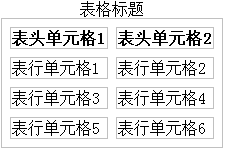
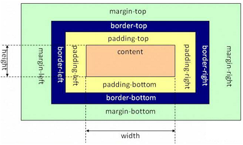

# 目录

- [目录](#目录)
- [简介](#简介)
  - [简介](#简介-1)
  - [引入方式](#引入方式)
    - [一、外部样式表](#一外部样式表)
    - [二、内部样式表](#二内部样式表)
    - [三、行内样式表](#三行内样式表)
- [CSS 选择器](#css-选择器)
    - [〇、介绍](#〇介绍)
    - [一、元素选择器](#一元素选择器)
    - [二、ID 选择器](#二id-选择器)
    - [三、类选择器](#三类选择器)
    - [四、后代选择器](#四后代选择器)
    - [五、群组选择器](#五群组选择器)
- [各类样式](#各类样式)
  - [字体样式](#字体样式)
    - [一、字体类型](#一字体类型)
    - [二、字体大小](#二字体大小)
    - [三、字体粗细](#三字体粗细)
    - [四、字体风格](#四字体风格)
    - [五、字体颜色](#五字体颜色)
  - [文本样式](#文本样式)
    - [一、首行缩进](#一首行缩进)
    - [二、水平对齐](#二水平对齐)
    - [三、文本修饰](#三文本修饰)
    - [四、大小写](#四大小写)
    - [五、行高](#五行高)
    - [六、间距](#六间距)
  - [边框样式](#边框样式)
    - [一、整体样式](#一整体样式)
      - [1．边框宽度](#1边框宽度)
      - [2．边框外观](#2边框外观)
      - [3．边框颜色](#3边框颜色)
      - [4．简写形式](#4简写形式)
    - [二、局部样式](#二局部样式)
  - [列表样式](#列表样式)
    - [一、列表项符号](#一列表项符号)
    - [二、列表项图片](#二列表项图片)
  - [表格样式](#表格样式)
    - [一、标题位置](#一标题位置)
    - [二、边框合并](#二边框合并)
    - [三、边框间距](#三边框间距)
  - [图片样式](#图片样式)
    - [一、图片大小](#一图片大小)
    - [二、图片边框](#二图片边框)
    - [三、图片对齐](#三图片对齐)
    - [四、文字环绕](#四文字环绕)
  - [背景样式](#背景样式)
    - [一、背景颜色](#一背景颜色)
    - [二、背景图片](#二背景图片)
      - [1．图片样式](#1图片样式)
      - [2．图片重复](#2图片重复)
      - [3．图片位置](#3图片位置)
      - [4．图片固定](#4图片固定)
  - [超链接样式](#超链接样式)
    - [一、伪类](#一伪类)
    - [二、hover](#二hover)
    - [三、鼠标样式](#三鼠标样式)
      - [1．浏览器鼠标样式](#1浏览器鼠标样式)
      - [2．自定义鼠标样式](#2自定义鼠标样式)
- [页面布局](#页面布局)
  - [盒子模型](#盒子模型)
    - [一、介绍](#一介绍)
    - [二、width 和 height](#二width-和-height)
    - [三、内边距](#三内边距)
    - [四、外边距](#四外边距)
  - [浮动布局](#浮动布局)
    - [一、设置浮动](#一设置浮动)
    - [二、清除浮动](#二清除浮动)
  - [定位布局](#定位布局)
    - [一、固定定位](#一固定定位)
    - [二、相对定位](#二相对定位)
    - [三、绝对定位](#三绝对定位)
    - [四、静态定位](#四静态定位)

# 简介

## 简介

CSS，指的是Cascading Style Sheet（层叠样式表），是用来控制网页外观的一门技术。
CSS发展至今，历经CSS1.0、CSS2.0、CSS2.1以及CSS3.0几个版本。其中，CSS2.1是CSS2.0的修订版，CSS3.0是CSS的最新版本。

## 引入方式

### 一、外部样式表
外部样式表是最理想的CSS引入方式。在实际开发中，为了提升网站的性能速度和可维护性，一般都是使用外部样式表。所谓的外部样式表，指的是把CSS代码和HTML代码都单独放在不同文件中，然后在HTML文档中使用link标签来引用CSS样式表。

```html
<link rel="stylesheet" type=""
```

其实还有种引用方法是@import，这种引用是先加载 html 后加载 css，所以不建议用。

### 二、内部样式表

内部样式表，是指 CSS 和 HTML 代码在同一个 HTML 文件中，CSS 代码是放在 head标签内部的。

```css
<style type="text/css">
	……
</style>
```

` type="text/css"` 表示是最标准的 css，是必须添加的。

### 三、行内样式表

行内样式表就是放在标签内，即标签的 style 属性。

```css
<a style="color:red;"
```

# CSS 选择器

### 〇、介绍

一个 HTML 代码中有很多个标签，如何能够选择到自己想要增加的样式呢？这便是 CSS 选择器。

选择器的格式为：

```css
选择器{
  属性1:取值1;
  属性2:取值2;
}
```

### 一、元素选择器

元素选择器，就是选中相同的元素，然后对相同的元素定义同一个CSS样式。

```css
/* 选择 div 元素，使所有 div 元素的文本颜色为红色 */
<style type="text/css">
	div{color:red;}
</style>
```

### 二、ID 选择器

我们可以为元素设置一个id属性，然后针对设置了这个id的元素定义CSS样式，这就是id选择器。不过要注意一点，**ID 是唯一的 ！**

```css
/* ID 选择器要加上#号 */
<style type="text/css">
#lvye{
  color:red;
}
</style>
...
<body>
	<div id="lvye">lvye</div>
</div>
```

### 三、类选择器

class选择器，也就是“类选择器”。我们可以对“相同的元素”或者“不同的元素”定义相同的class属性，然后针对拥有同一个class的元素进行CSS样式操作。

```css
/* 类选择器要加上.号 */
<head>
    <meta charset="utf-8" />
    <title></title>
    <style type="text/css">
        .lv{color:red;}
    </style>
</head>
<body>
    <div>绿叶学习网</div>
    <div class="lv">绿叶学习网</div>
    <div class="lv">绿叶学习网</div>
</body>
```

### 四、后代选择器

后代选择器，就是选择元素内部中所有的某一种元素，包括子元素和其他后代元素（如“孙元素”）。

```css
#father son{
  
}
```

### 五、群组选择器

群组选择器，指的是同时对几个选择器进行相同的操作。

```css
h1,div,p,span{
  
}

<!DOCTYPE html>
<html>
  <head>
    <style>
      #a1,.a2{
        color:red;
      }
    </style>
  </head>
  <body>
    <div id="a1">Im a1</div>
    <div class="a2">Im a2div</div>
    <span class="a2">Im a2span</span>
  </body>
</html>
```


# 各类样式

## 字体样式

### 一、字体类型

```css
font-family: 字体1, 字体2, ... , 字体N;
```

字体可以定义多个，那么为什么要定义多个字体呢？每个人的电脑装的字体都不一样，有些字体有安装，但也有些字体没有安装。所以按照顺序来为用户显示。

**在实际开发中，比较美观的中文字体有微软雅黑、苹方，英文字体有Times New Roman 、Arial和Verdana。**

### 二、字体大小

```css
font-size: 10px;
```

实际上，font-size属性取值有两种：一种是“关键字”，如small、medium、large等；另外一种是“像素值”，如10px、16px、21px等。

不过在实际开发中，关键字这种方式基本不会用，因此我们只需要掌握像素值方式即可。

### 三、字体粗细

```css
font-weight: 关键字;
```

关键字的取值有：normal, lighter, bold, bolder。**实际开发中 bold 是最常用的。**


### 四、字体风格

```css
font-style: 取值;
```

关键字的取值有：normal, italic, oblique。后两个都是斜体效果。

有些字体有斜体italic属性，但有些字体却没有italic属性。oblique是让没有italic属性的字体也能够有斜体效果。

**实际开发基本用不上。**

### 五、字体颜色

```css
color: red;
```

取值可以为关键字，也可以是十六进制 RGB 值。

## 文本样式

### 一、首行缩进

```css
text-indent: 10px;
```

想要达到首行缩进的效果，取值要为 font-size 大小的两倍。

### 二、水平对齐

```css
text-align: 关键字;
```

关键字的取值为：left, **center**, right。

除此之外，`text-align`对 img 标签也有效果。

### 三、文本修饰

```css
text-decoration: 取值;
```

关键字取值有：none, underline, line-through, overline。

对于除去超链接的下划线，我们可以使用`text-decoration: none;`

### 四、大小写

```css
text-transform: 取值;
```

关键字取值有：none, uppercase, lowercase, capitalize(首字母大写)

### 五、行高

```css
line-height: 10px
```

line-height属性涉及的理论知识非常多，也极其重要，这一节只是简单接触一下。

### 六、间距

```css
letter-spacing: 10px;
word-spacing: 10px;
```

分别是字母间距和单词间距。

在实际开发中，对于中文网页来说，我们很少去定义字间距以及词间距这些东西。letter-spacing和word-spacing只会用于英文网页，这两个平常我们几乎用不上，**因此只需简单了解即可。**

## 边框样式

### 一、整体样式

#### 1．边框宽度

```css
border-width: 10px;
```

#### 2．边框外观

```css
border-style: 取值;
```

关键字有：none, dashed(虚线), solid(实线)。

#### 3．边框颜色

```css
border-color: red;
```

#### 4．简写形式

```css
border: 10px solid red;
```

### 二、局部样式

`border-left-width` ……

## 列表样式

### 一、列表项符号

```css
list-style-type: 取值;
list-style-type: none;
```

ist-style-type属性是针对ol或者ul元素的，而不是li元素。其中，list-style-type属性取值如下表所示。

**表 1 ol 的取值**

| 属性值      | 说明                           |
| :---------- | :----------------------------- |
| decimal     | 阿拉伯数字：1、2、3…（默认值） |
| lower-roman | 小写罗马数字：i、ii、iii…      |
| upper-roman | 大写罗马数字：I、II、III…      |
| lower-alpha | 小写英文字母：a、b、c…         |
| upper-alpha | 大写英文字母：A、B、C…         |

**表 2 ul 的取值**

| 属性值 | 说明              |
| :----- | :---------------- |
| disc   | 实心圆●（默认值） |
| circle | 空心圆○           |
| square | 正方形■           |

### 二、列表项图片

```css
list-style-img: xxx;
```

真正的开发中，我们会使用 iconfont 图标技术。

## 表格样式

### 一、标题位置

```css
caption-side: 取值;
```

关键字有：top(默认), bottom

### 二、边框合并

```css
border-collapse: 取值;
```

关键字有：separate, collapse

### 三、边框间距

```css
border-spacing: 10px;
```



## 图片样式

### 一、图片大小

```css
width: 10px;
height: 10px;
```

在实际开发中，如果你需要多大的图片，就用 Photoshop 制作多大的图片。不建议使用一张大图片，然后再借助width和height来改变大小。因为一张大图片体积更大，会使页面加载速度变慢。

### 二、图片边框

```css
border: 1px solid red; 
```

### 三、图片对齐

```css
text-align: center; /* 水平对齐 */
vertical: top, middle, baseline(基线对齐), bottom; /* 垂直对齐 */
```

### 四、文字环绕

```css
float: left, right;
```

## 背景样式

### 一、背景颜色

```css
background-color: red;
```

### 二、背景图片

#### 1．图片样式

```css
background-image: url(xxx);
```

#### 2．图片重复

```css
background-repeat: 取值;
```

取值有 repeat, repeat-x, repeat-y, no-repeat

#### 3．图片位置

```css
background-position: 水平距离 垂直距离;
/* 关键字或者是像素 */
```

| 属性值        | 说明     |
| :------------ | :------- |
| top left      | 左上     |
| top center    | 靠上居中 |
| top right     | 右上     |
| center left   | 居中靠左 |
| center center | 正中     |
| center right  | 居中靠右 |
| bottom left   | 左下     |
| bottom center | 靠下居中 |
| bottom right  | 右下     |

#### 4．图片固定

```css
background-attachment: 取值;
```

取值有：scroll(随元素滚动，默认值)，fixed(固定不动)

## 超链接样式

### 一、伪类

在浏览器中，超链接的外观如下图所示。可以看出，超链接在鼠标点击不同时期的样式是不一样的。


```css
/* 分别为未访问、访问后、鼠标经过、点击激活的样式 */
a{} /* 即未访问样式*/
a:link{}
a:visited{}
a:hover{}
a:active{}
/* 同时定义伪类时必须严格按照顺序，love hate原则 */
```

实际开发中，只需要 a和 a:hover

### 二、hover

实际上，hover 不仅仅定义于超链接的 a 元素，其他的元素同样实用。

```css
div:hover{}
img:hover{}
```

 “:hover伪类”应用非常广泛，任何一个网站都会大量地用到，**我们要好好掌握。**

### 三、鼠标样式

#### 1．浏览器鼠标样式

```css
cursor: 取值;
```

实际开发中只需要记住 default, pointer, text.


#### 2．自定义鼠标样式

```css
cursor: url(图片地址), 属性值;
```

这个“图片地址”是鼠标图片地址，其中鼠标图片后缀名一般都是.cur，我们可以使用Photoshop来制作，小伙伴们自行搜索一下制作方法。

而这个“属性值”一般为3种：default、pointer和text。

# 页面布局

## 盒子模型

### 一、介绍

在“CSS盒子模型”理论中，页面中的所有元素都可以看成一个盒子，并且占据着一定的页面空间。图21-1所示为一个CSS盒子模型的具体结构。



一个页面由很多这样的盒子组成，这些盒子之间会互相影响，因此掌握盒子模型需要从两个方面来理解：一是理解单独一个盒子的内部结构（往往是padding）；二是理解多个盒子之间的相互关系（往往是margin）。

每个元素都看成一个盒子，盒子模型是由四个属性组成的：content（内容）、padding（内边距）、margin（外边距）和border（边框）。此外，在盒子模型中，还有宽度width和高度height两大辅助性属性。**记住，所有的元素都可以看成一个盒子**。

从上面我们可以知道，盒子模型的组成部分有4个，如下表所示。

| 属性    | 说明                                         |
| :------ | :------------------------------------------- |
| content | 内容，可以是文本或图片                       |
| padding | 内边距，用于定义内容与边框之间的距离         |
| margin  | 外边距，用于定义当前元素与其他元素之间的距离 |
| border  | 边框，用于定义元素的边框                     |

### 二、width 和 height

只有块元素才可以设置width和height，行内元素是无法设置width和height的。（我们这里不考虑inline-block元素）

### 三、内边距

```css
padding-left,right,bottom,left: xxpx;
padding: 10px; /* 四个内边距为10px */
padding: 10px 20px; /* 上下10px，左右20px */
padding: 10px 10px 10px 10px; /* 上右下左，既顺时针 */
```

### 四、外边距

```css
margin:
/* 与内边距用法相同 */
```

## 浮动布局

>  浮动是CSS布局的最佳利器，我们可以通过浮动来灵活地定位页面元素，以达到布局网页的目的。例如我们可以通过设置float属性让元素向左浮动或者向右浮动，以便让周围的元素或文本环绕着这个元素。

### 一、设置浮动

```css
float: ;
```

float 的取值只有 left 和 right。

### 二、清除浮动

```css
clear: ;
```

clear 的取值有left, right, both。

## 定位布局

> 在此之前，我们学习了浮动布局。浮动布局比较灵活，但是不容易控制。而定位布局的出现，使得用户精准定位页面中的任意元素成为可能，此时页面布局操作也变得更加随心所欲。当然了，由于定位布局缺乏灵活性，也给空间大小和位置不确定的版面布局带来困惑。因此在实际开发中，大家应该灵活使用这两种布局方式，这样才可以更好地满足开发需求。

### 一、固定定位

```css
position: fixed;
top: 像素值;
bottom: 像素值;
left: 像素值;
right: 像素值;
```

固定定位将元素固定在浏览器的某一位置，不会虽滑动条的改变而改变。最常见的便是“回到顶部按钮”。


### 二、相对定位

```css
position: relative;
top: 像素值;
bottom: 像素值;
left: 像素值;
right: 像素值;
```

所谓的相对定位，指的是该元素的位置是相对于它的原始位置计算而来的。

我们为第2个div元素加入相对定位，CSS代码如下：

```css
#son2
{
    position:relative;
    top:20px;
    left:40px;
}
```

此时浏览器中效果如下图所示。


### 三、绝对定位

绝对定位在几种定位方式中使用最为广泛，因为它能够很精确地把元素定位到任意你想要的位置。

一个元素变成了绝对定位元素，这个元素就完全脱离文档流了，绝对定位元素的前面或后面的元素会认为这个元素并不存在，此时这个元素浮于其他元素上面，已经完全独立出来了。

```css
position: absolute;
top: 像素值;
bottom: 像素值;
left: 像素值;
right: 像素值;
```

我们为第2个div元素加入绝对定位，CSS代码如下：

```css
#son2
{
    position:absolute;
    top:20px;
    right:40px;
}
```

此时在浏览器中效果如下图所示。


总结：**默认情况下，固定定位和绝对定位的位置是相对于浏览器而言，而相对定位的位置是相对原始位置而言**。

### 四、静态定位

在默认情况下，元素没有指定position属性时，这个元素就是静态定位的。也就是说，元素position属性的默认值是static。

一般情况下我们使用不到position:static的，不过在使用JavaScript来控制元素定位时，如果想要使得元素从其他定位方式变成静态定位，就需要使用position:static来实现。

在CSS入门中，我们只需要掌握固定定位、相对定位和绝对定位3种就可以了，静态定位了解一下就行。