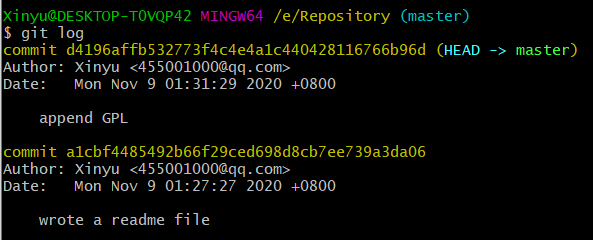
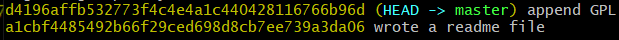
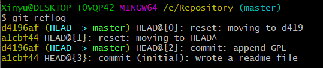

# 目录

- [目录](#目录)
- [一、Git环境搭建](#一git环境搭建)
  - [1.1 Git本地安装](#11-git本地安装)
  - [1.2 创建版本库](#12-创建版本库)
    - [1.2.1 创建空文件夹](#121-创建空文件夹)
    - [1.2.2 添加文件到仓库](#122-添加文件到仓库)
- [二、Git管理](#二git管理)
  - [2.1 版本回退](#21-版本回退)
    - [2.1.1 修改文件](#211-修改文件)
    - [2.1.2 版本回退](#212-版本回退)
  - [2.2 工作区和暂存区](#22-工作区和暂存区)
    - [2.2.1 工作区](#221-工作区)
    - [2.2.2 版本库](#222-版本库)
  - [2.3 管理修改](#23-管理修改)
  - [2.4 撤销修改](#24-撤销修改)
  - [2.5 删除文件](#25-删除文件)
- [三、远程仓库](#三远程仓库)
  - [3.1 创建远程仓库](#31-创建远程仓库)
  - [3.2 推送本地仓库](#32-推送本地仓库)
  - [3.3 克隆仓库](#33-克隆仓库)
  - [3.4 合并仓库](#34-合并仓库)
- [四、分支管理](#四分支管理)
  - [4.1 创建与合并分支](#41-创建与合并分支)
    - [4.1.1 创建分支](#411-创建分支)
    - [4.1.2 查看分支](#412-查看分支)
    - [4.1.3 切换分支](#413-切换分支)
    - [4.1.4 合并分支](#414-合并分支)
    - [4.1.5 删除分支](#415-删除分支)
  - [4.2 解决冲突](#42-解决冲突)
  - [4.3 分支管理](#43-分支管理)
    - [4.3.1 分支策略](#431-分支策略)
    - [4.3.2 分支合并模式](#432-分支合并模式)
  - [4.4 bug分支](#44-bug分支)
    - [4.4.1 隐藏现场](#441-隐藏现场)
    - [4.4.2 提交修改](#442-提交修改)
  - [4.5 Feature分支](#45-feature分支)
  - [4.6 多人协作](#46-多人协作)
    - [4.6.1 推送分支](#461-推送分支)
    - [4.6.2 抓取分支](#462-抓取分支)
- [五、标签管理](#五标签管理)
  - [5.1 创建标签](#51-创建标签)
  - [5.2 操作标签](#52-操作标签)

# 一、Git环境搭建

> 本文按照[廖雪峰](https://www.liaoxuefeng.com/wiki/896043488029600)老师的教程摘抄整理。
>
> Git是目前世界上最先进的分布式版本控制系统。

## 1.1 Git本地安装

Windows上进入Git官网，默认安装即可。之后使用：

```bash
git config --global user.name "XinyuLoveAo"
git config --global user.email "455001000@qq.com"
```

## 1.2 创建版本库

### 1.2.1 创建空文件夹

创建空文件夹作为版本库，之后键入

```bash
cd /e/Repository
git init
```

### 1.2.2 添加文件到仓库

编写一个readme.txt,

```bash
git add readme.txt
git commit -m "wrote a readme file"
```

# 二、Git管理

## 2.1 版本回退

### 2.1.1 修改文件

```
Git is a distributed version control system.
git is free software distributed under the GPL.
```

```bash
git add readme.txt
git commit -m "append GPL"
```

版本1：wrote a readme file

```
Git is a version control system.
Git is free software.
```

版本2：append GPL

```
Git is a distributed version control system.
Git is free software distributed under the GPL.
```

使用 `git log` 命令显示从最近到最远的提交日志



`git log --pretty=oneline`



前面的数字为版本号，是一个SHA1计算出来的一个非常大的数字，用十六进制表示。

### 2.1.2 版本回退

在Git中，用`HEAD`表示当前版本，上一个版本就是`HEAD^`，上上一个版本就是`HEAD^^`，当然往上100个版本写100个`^`比较容易数不过来，所以写成`HEAD~100`。

我们要把当前版本`append GPL`回退到上一个版本` wrote a readme file`，就可以使用`git reset`命令：

```bash
git reset --hard HEAD^
```

此时`git log`已经看不到最新版本了，如果想回去怎么办呢？

```bash
git reset --hard d419
```

`commit id`写前几位就可以

Git的版本回退速度非常快，因为Git在内部有个指向当前版本的`HEAD`指针，当你回退版本的时候，Git仅仅是把HEAD从指向`append GPL`，改为指向`wrote a readme file`：

然后顺便把工作区的文件更新了。所以你让`HEAD`指向哪个版本号，你就把当前版本定位在哪。

**要重返未来，用`git reflog`查看命令历史，以便确定要回到未来的哪个版本。**



## 2.2 工作区和暂存区

### 2.2.1 工作区

是你在电脑里能看到的目录，比如我的`Repository`文件夹就是一个工作区

### 2.2.2 版本库

工作区有一个隐藏目录`.git`，这个不算工作区，而是Git的版本库。

Git的版本库里存了很多东西，其中最重要的就是称为stage（或者叫index）的暂存区，还有Git为我们自动创建的第一个分支`master`，以及指向`master`的一个指针叫`HEAD`。

前面讲了我们把文件往Git版本库里添加的时候，是分两步执行的：

第一步是用`git add`把文件添加进去，实际上就是把文件修改添加到暂存区；

第二步是用`git commit`提交更改，实际上就是把暂存区的所有内容提交到当前分支。


## 2.3 管理修改

>  为什么Git比其他版本控制系统设计得优秀，因为Git跟踪并管理的是修改，而非文件。

第一次修改 -> `git add` -> 第二次修改 -> `git add` -> `git commit`

`git status`查看状态

## 2.4 撤销修改

`git checkout -- readme.txt`可以丢弃工作区的修改

命令`git checkout -- readme.txt`意思就是，把`readme.txt`文件在工作区的修改全部撤销，这里有两种情况：

一种是`readme.txt`自修改后还没有被放到暂存区，现在，撤销修改就回到和版本库一模一样的状态；

一种是`readme.txt`已经添加到暂存区后，又作了修改，现在，撤销修改就回到添加到暂存区后的状态。

总之，就是让这个文件回到最近一次`git commit`或`git add`时的状态。

**总结：**

1. 没有`git add`时，用`git checkout -- file`
2. 已经`git add`时，先`git reset HEAD <file>`回退到1.，再按1.操作
3. 已经`git commit`时，用`git reset`回退版本

## 2.5 删除文件

命令`git rm`用于删除一个文件。如果一个文件已经被提交到版本库，那么你永远不用担心误删，但是要小心，你只能恢复文件到最新版本，你会丢失**最近一次提交后你修改的内容**。

# 三、远程仓库

## 3.1 创建远程仓库

创建Github与Gitee仓库之后，

关联Github仓库：

```bash
git remote add github git@github.com:XinyuLoveAo/Front-End-Learning-Notes.git
```

关联Gitee仓库：

```bash
git remote add gitee git@gitee.com:XinyuLoveAO/Front-End-Learning-Notes.git
```

## 3.2 推送本地仓库
```bash
git push github/gitee master
```

把本地库的内容推送到远程，用`git push`命令，实际上是把当前分支`master`推送到远程。

## 3.3 克隆仓库

```bash
git clone https://github.com/XinyuLoveAo/Front-End-Learning-Notes.git
```
git clone 默认是克隆Head指向的master分支，如果是多分支，需要以下命令：

```bash
git checkout -b dev origin/dev
# 作用是checkout远程仓库origin的分支dev，在本地起名为dev分支，并切换到本地的dev分支
```

## 3.4 合并仓库

```bash
git pull github/gitee master
```

# 四、分支管理

## 4.1 创建与合并分支

### 4.1.1 创建分支

首先，我们**创建**`dev`分支，然后切换到`dev`分支：

```bash
git checkout -b dev or git switch -c dev
```

### 4.1.2 查看分支

然后，用`git branch`命令**查看**当前分支：

```bash
git branch
* dev 当前分支前面会标一个*号。
  master
```

然后，我们就可以在`dev`分支上正常提交，比如对`readme.txt`做个修改，加上一行：

```
This is dev branch.
```

**提交**：

```bash
git add readme.txt 
git commit -m "branch test"
```

### 4.1.3 切换分支

切换回`master`分支

```bash
git checkout master or git switch master
```

切换回`master`分支后，再查看一个`readme.txt`文件，刚才添加的内容不见了！因为那个提交是在`dev`分支上，而`master`分支此刻的提交点并没有变

现在，我们把`dev`分支的工作成果**合并**到`master`分支上：

### 4.1.4 合并分支

```bash
git merge dev
```

`git merge`命令用于合并指定分支到当前分支。合并后，再查看`readme.txt`的内容，就可以看到，和`dev`分支的最新提交是完全一样的。

### 4.1.5 删除分支

合并完成后，就可以放心地**删除**`dev`分支了：

```bash
git branch -d dev
```

删除远程仓库的`dev`分支：
```bash
git push --delete origin dev
```

## 4.2 解决冲突

当两个分支各自有着修改时，分支的合并便会有冲突。

合并后，Git用`<<<<<<<`，`=======`，`>>>>>>>`标记出不同分支的内容，我们修改后保存

提交，最后再删除分支。用`git log --graph`命令可以看到分支合并图。

## 4.3 分支管理

### 4.3.1 分支策略

在实际开发中，我们应该按照几个基本原则进行分支管理：

1. `master`分支应该是非常稳定的，也就是仅用来发布新版本；
2. `dev`分支是不稳定的，到某个时候，比如1.0版本发布时，再把`dev`分支合并到`master`上，在`master`分支发布1.0版本。

### 4.3.2 分支合并模式

准备合并`dev`分支，请注意`--no-ff`参数，表示禁用`Fast forward`：

```bash
git merge --no-ff -m "merge with no-ff" dev
```

## 4.4 bug分支

### 4.4.1 隐藏现场

Git提供了一个`stash`功能，可以把当前工作现场“储藏”起来，等以后恢复现场后继续工作：

```bash
隐藏：git stash
恢复：git stash list
```

### 4.4.2 提交修改

> dev分支是早期从master分支分出来的，所以，这个bug其实在当前dev分支上也存在。那怎么在dev分支上修复同样的bug？

```bash
git cherry-pick <commit>
```

## 4.5 Feature分支

开发一个新feature，最好新建一个分支；

如果要丢弃一个没有被合并过的分支，可以通过`git branch -D <name>`强行删除。

## 4.6 多人协作

### 4.6.1 推送分支

1. `master`分支是主分支，要时刻与远程同步；
2. `dev`分支是开发分支，团队所有成员都需要在上面工作，需要与远程同步；
3. bug分支只用于在本地修复bug，没必要推到远程了，
4. feature分支是否推到远程，取决于你是否和你的小伙伴合作在上面开发。

### 4.6.2 抓取分支

多人协作的工作模式通常是这样：

1. 首先，可以试图用`git push origin <branch-name>`推送自己的修改；
2. 如果推送失败，则因为远程分支比你的本地更新，需要先用`git pull`试图合并；
3. 如果合并有冲突，则解决冲突，并在本地提交；
4. 没有冲突或者解决掉冲突后，再用`git push origin <branch-name>`推送就能成功！

如果`git pull`提示`no tracking information`，则说明本地分支和远程分支的链接关系没有创建，用命令`git branch --set-upstream-to <branch-name> origin/<branch-name>`。

这就是多人协作的工作模式，一旦熟悉了，就非常简单。

# 五、标签管理

## 5.1 创建标签

打到最新版本上：`git tag v1.0`

打到自定义版本：`git tag v0.9 <commit>`

查看所有标签：`git tag`

## 5.2 操作标签

命令`git push origin <tagname>`可以推送一个本地标签；

命令`git push origin --tags`可以推送全部未推送过的本地标签；

命令`git tag -d <tagname>`可以删除一个本地标签；

命令`git push origin :refs/tags/<tagname>`可以删除一个远程标签。