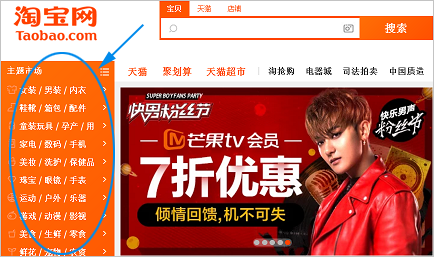
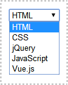

# 简介

HTML全程为Hyper Text Markup Language（**超文本标记语言**），是网页的标准语言。HTML并不是一门编程语言，而是一门描述性的标记语言。

HTML是一门描述性的语言，就是用标签来说话。举个例子，如果你要在浏览器显示一段文字，就应该使用“段落标签——p”；如果要在浏览器显示一张图片，就应该使用“图片标签——img”。针对你想显示东西的不同，使用的标签也会不同。

绿叶学习网的指导路线多了jQuery，也应该顺便学习一下。

# 基本标签

## 一、HTML结构

### 1．文档声明

`<!DOCTYPE html>`是一个文档声明，表示这是一个HTML页面。

### 2．HTML标签

HTML标签的作用，是在告诉浏览器，这个页面是从开始，然后到结束的。在实际开发中，我们可能会经常看到这样一行代码：

```html
<html xmlns="http://www.w3.org/1999/xhtml">
```

这句代码的作用是告诉浏览器，当前页面使用的是W3C的XHTML标准。这里我们了解即可，不用深究。一般情况下，我们不需要加上`xmlns="http://www.w3.org/1999/xhtml"`这一句。

### 3．head标签

`<head></head>`是网页的“头部”，用于定义一些特殊的内容，如页面标题、定时刷新、外部文件等。

### 4．body标签

`<body></body>`是网页的“身体”。对于一个网页来说，大部分代码都是在这个标签对内部编写的。

### 5．示例

```html
<!DOCTYPE html>
<html>
	<head>
		<meta charset="utf-8" />
		<title>new html</title>
	</head>
	<body>
		<p>hello world!</p>
	</body>
</html>
```

## 二、head标签

###  1．title

用于定义网页的标题

### 2．meta

在HTML中，meta标签一般用于定义页面的特殊信息，例如页面关键字、页面描述等。这些信息不是提供给用户看的，而是提供给搜索引擎蜘蛛（如百度蜘蛛、谷歌蜘蛛）看的。简单来说，meta标签就是用来告诉“搜索蜘蛛”这个页面是干嘛的。

> 注：在Web技术中，我们一般形象地称搜索引擎为“搜索蜘蛛”或“搜索机器人”。

在HTML中，meta标签有两个重要的属性：name和http-equiv。

**（1）name属性**

| 属性值      | 说明                                     |
| :---------- | :--------------------------------------- |
| keywords    | 网页的关键字，可以是多个，而不仅仅是一个 |
| description | 网页的描述                               |
| author      | author                                   |
| copyright   | 版权信息                                 |

在实际开发中，我们一般只会用到keywords和description。也就是说记住这两个就可以了，其他的都不用管。

```html
<meta name="keywords" content="html" />
<meta name="description" content="html test" />
```
**（2）http-equiv属性**

  1⃣️网页编码

**必须放在head最前方，即head标签内第一行。**

```html
<meta http-equiv="Content-Type" content="text/html";charset="utf-8" />
```

不过在HTML5标准中，上面这句代码可以简写为：

```html
<meta charset="utf-8" />
```

2⃣️自动刷新

```html
<meta  http-equiv="refresh" content="6;url=http://www.baidu.com"/>
```

不输入url参数即自动刷新本页面。

### 3．style

用来定义css样式，type值固定。

```css
<style type="text/css">
	/*这里写CSS样式*/
</style>
```

### 4．script

用于定义页面的JavaScript代码，也可以引入外部JavaScript文件。

### 5．link

用于引入外部样式文件（CSS文件）。

```html
<link type="text/css" rel="stylesheet" href="css/index.css">
```

### 6．base

没啥用

## 三、注释

<!---->又叫注释标签。<!--表示注释的开始，-->表示注释的结束。

为关键代码添加注释是一个良好的习惯。

# 文本

## 一、标题标签

在HTML中，共有6个级别的标题标签：h1、h2、h3、h4、h5、h6。其中h是header的缩写。6个标题标签在页面中的重要性是有区别的，其中h1标签的重要性最高，h6标签的重要性最低。

h1~h6标题标签看起来很简单，但是在搜索引擎优化中却扮演着非常重要的角色。

## 二、段落标签

`<p>`与`<br>`都有换行的作用，使用p标签会导致段落与段落之间有一定的间隙，而使用br标签则不会。

br标签是用来给文字换行的，而p标签是用来给文字分段的。

## 三、文本标签

| 标签   | 语义                  | 说明 |
| :----- | :-------------------- | :--- |
| strong | strong（强调）        | 粗体 |
| em     | emphasized（强调）    | 斜体 |
| sup    | superscripted（上标） | 上标 |
| sub    | subscripted（下标）   | 下标 |

其余的s（中划线），u（下划线），大小号字体（big，small）一般用css实现，几乎不用标签。

## 四、水平线标签

`<hr />`来实现一条水平线。hr，是horizon（水平线）的缩写。

## 五、div标签

`<div></div>`来实现区域分割。

## 六、自闭合标签

| 标签  | 说明                             |
| :---- | :------------------------------- |
| meta  | 定义网页的信息（供搜索引擎查看） |
| link  | 引入“外部CSS文件”                |
| br    | 换行标签                         |
| hr    | 水平线标签                       |
| img   | 图片标签                         |
| input | 表单标签                         |

## 七、块元素和行内元素

**表1 HTML常见块元素**

| 块元素 | 说明     |
| :----- | :------- |
| h1~h6  | 标题元素 |
| p      | 段落元素 |
| div    | div元素  |
| hr     | 水平线   |
| ol     | 有序列表 |
| ul     | 无序列表 |

**表2 HTML常见行内元素**

| 行内元素 | 说明                          |
| :------- | :---------------------------- |
| strong   | 粗体元素                      |
| em       | 斜体元素                      |
| a        | 超链接                        |
| span     | 常用行内元素，结合CSS定义样式 |

块元素和行内元素非常复杂，大家在这一节重点理解其概念就行了，而不需要去记忆块元素有哪些、行内元素有哪些。

## 八、特殊符号

| 特殊符号 | 说明           | 代码   |
| :------- | :------------- | :----- |
| `"`      | 双引号（英文） | 	&quot;   |
| `‘`      | 左单引号       |	&lsquo;   |
| `’`      | 右单引号       |	&rsquo;    |
| `×`      | 乘号           |	&times;   |
| `÷`      | 除号           |	&divide;  |
| `>`      | 大于号         |&gt;  |
| `<`      | 小于号         |	&lt;   |
| `&`      | “与”符号       | 	&amp;  |
| `—`      | 长破折号       | &mdash;  |
| \|       | 竖线           | &#124; |
| `§`      | 分节符   | 	&sect;|
| `©`      | 版权符   | 	&copy;  |
| `®`      | 注册商标 | 	&reg;  |
| `™`      | 商标     |&trade; |
| `€`      | 欧元     |	&euro; |
| `£`      | 英镑     | 	&pound;  |
| `¥`      | 日元     | 	&yen;  |
| `°`      | 度       | 	&deg;  |
|  | 空格 | &nbsp |

对于这一节，我们只需要记忆“空格”这一个特殊符号就行了，其他特殊符号不需要记忆，等需要时再回这里查一下就可以了。

# 列表

## 一、有序列表

### 1．简介

ol，即ordered list（有序列表）；li，即list（列表项）。理解标签的语义更有利于你记忆。

注意，ol标签和li标签是配合一起使用，不可以单独使用，而且<ol>标签的子标签只能是li标签，不能是其他标签。

```html
<ol>
    <li>列表项</li>
    <li>列表项</li>
    <li>列表项</li>
</ol>
```

### 2．类型

在有序列表中，type属性取值如下表所示。

| 属性值 | 列表项符号                 |
| :----- | :------------------------- |
| 1      | 阿拉伯数字：1、2、3……      |
| a      | 小写英文字母：a、b、c……    |
| A      | 大写英文字母：A、B、C……    |
| i      | 小写罗马数字：i、ii、iii…… |
| I      | 大写罗马数字：I、II、III…… |

对于有序列表的列表项符号，等学了CSS之后，我们可以放弃type属性，而使用list-style-type属性。

## 二、无序列表

### 1．简介

ul，即unordered list（无序列表）。li，即list（列表项）。

注意，ul标签和li标签也是配合一起使用，不可以单独使用，而且ul标签的子标签也只能是li标签，不能是其他标签。这一点跟有序列表是一样的。

```html
<ul>
    <li>列表项</li>
    <li>列表项</li>
    <li>列表项</li>
</ul>
```

### 2．类型

| 属性值 | 列表项符号        |
| :----- | :---------------- |
| disc   | 实心圆●（默认值） |
| circle | 空心圆○           |
| square | 正方形■           |

跟有序列表一样，对于无序列表的列表项符号，等学了CSS之后，我们可以放弃type属性，而使用list-style-type属性。

### 3．深入无序列表

> 在实际的前端开发中，无序列表比有序列表更为实用。更准确点说，我们一般都是使用无序列表，几乎用不到有序列表。不说别的，就拿绿叶学习网来说，主导航、工具栏、动态栏等地方都用到了无序列表。凡是需要显示列表数据的地方都用到了，可谓无处不在！


> 下面，我们再来看看大型网站在哪些地方用到了无序列表，如下面3张图片所示。





> 可能很多人都疑惑：这些效果是怎样用无序列表做出来的呢？网页外观嘛，当然都是用CSS来实现的啊！现在不懂没关系，为了早日做出这种美观的效果，小伙伴们好好加油把CSS学好！

此外，对于无序列表来说，还有以下两点要注意：

**（1）ul元素的子元素只能是li，不能是其他元素。**

**（2）ul元素内部的文本，只能在li元素内部添加，不能在li元素外部添加。**

## 三、定义列表

```html
<dl>
    <dt>名词</dt>
    <dd>描述</dd>
    ……
</dl>
```

dl即definition list（定义列表）；dt即definition term（定义名词）；而dd即definition description（定义描述）。

在该语法中，<dl>标记和</dl>标记分别定义了定义列表的开始和结束，dt标签用于添加要解释的名词，而dd标签用于添加该名词的具体解释。

在实际开发中，定义列表虽然用得比较少，但是在某些高级效果（如自定义表单）中也会用到。在HTML入门阶段，我们**了解一下**就行。

# 表格

## 一、简介

> 在早些年的Web 1.0时代，表格常用于网页布局。但是在Web 2.0中，这种方式已经被抛弃了，网页布局都是使用CSS来实现的（学了CSS就会知道）。但是这并没有说明表格就一无是处了，表格在实际开发中用得非常多，因为使用表格可以更清晰地排列数据。

## 二、结构

在HTML中，一个表格一般会由以下部分组成：

表格：table标签，标题：caption标签，行：tr标签，单元格：td标签，表头：th标签

```html
<table>
    <caption>表格标题</caption>
    <!--表头-->
    <thead>
        <tr>
            <th>表头单元格1</th>
            <th>表头单元格2</th>
        </tr>
    </thead>
    <!--表身-->
    <tbody>
        <tr>
            <td>表行单元格1</td>
            <td>表行单元格2</td>
        </tr>
        <tr>
            <td>表行单元格3</td>
            <td>表行单元格4</td>
        </tr>
    </tbody>
    <!--表脚-->
    <tfoot>
        <tr>
            <td>标准单元格5</td>
            <td>标准单元格6</td>
        </tr>
    </tfoot>
</table>
```

一个完整的表格包含：table、caption、tr、th、td。为了更深一地对表格进行语义化，HTML引入了thead、tbody和tfoot标签。

tr，指的是table row（表格行）；td，指的是table data cell（表格单元格）。th，指的是table header cell（表头单元格）

thead、tbody和tfoot把表格划分为3部分：表头、表身、表脚。有了这些标签，表格语义更加良好，结构更加清晰，也更具有可读性和可维护性。

## 三、合并行

`<td rowspan = "2"></td>`

所谓的合并行，其实就是将表格相邻的N个行合并。在这个例子中，rowspan="2"实际上是让加上rowspan属性的这个td标签跨越两行。

## 四、合并列

`<td colspan = "跨越的列数"></td>`

所谓的合并行，其实就是将表格相邻的N个列合并。

# 图片

## 一、标签属性

### 1．src属性

src属性用于指定图片所在的路径，可以是相对路径，也可以是绝对路径。

**（1）绝对路径**

绝对路径指的是图片在你的电脑中的完整路径。例如`D:/website/img/haizei.png`

**（2）绝对路径**

所谓的相对路径，指的是图片相对当前页面的位置。例如`../../../css/style.css`

### 2．alt属性和title属性

alt和title都是用于指定图片的提示文字。一般情况下，alt和title的值是相同的。不过两者也有很大的不同。

alt用于图片无法正常显示时，图片显示为的文字；title则是鼠标移到图片上时，就会显示的提示文字。

在实际开发中，对于img标签，**src和alt这两个是必选属性**，一定要添加；而title是可选属性，可加可不加。**alt是用于给搜索引擎看的。**

## 二、图片格式

> 在网页中，图片格式有两种：一种是“位图”；另外一种是“矢量图”。

### 1．位图

位图，又叫做“像素图”，它是由像素点组成的图片。对于位图来说，放大图片后，图片会失真；缩小图片后，图片同样也会失真。

在实际开发中，最常见位图的图片格式有3种（可以从图片后缀名看出来）：jpg（或jpeg）、png、gif。深入理解3种图片适合在哪种情况下使用，在前端开发中是非常重要的。

**（1）jpg可以很好地处理大面积色调的图片，适合存储颜色丰富的复杂图片，如照片、高清图片等。此外，jpg体积较大，并且不支持透明。**
**（2）png是一种无损格式，可以无损压缩以保证页面打开速度。此外，png体积较小，并且支持透明，不过不适合存储颜色丰富的图片。**
**（3）gif图片效果最差，不过它适合制作动画。实际上，小伙伴们经常在QQ或微信上发的动图都是gif格式的。**

这里来总结一下：如果想要展示色彩丰富而高品质图片，可以使用jpg格式；如果是一般图片，为了减少体积或者想要透明效果，可以使用png格式；如果是动画图片，可以使用gif格式。

### 2．矢量图

矢量图，又叫做“向量图”，它是用计算机图形学中点、直线或多边形等表示出来的几何图像。

矢量图是以一种数学描述的方式来记录内容的图片格式。举个例子，我们可以使用y=kx来绘制一条直线，当k取不同值时就会绘制不同角度的直线，这就是矢量图的构图原理。

矢量图最大的**优点**是：图片无论放大、缩小或旋转等都不会失真。最大的**缺点**是：难以表现色彩丰富的图片效果（非常差）。

矢量图常见格式有：“.ai”、“.cdf”、“.fh”、“.swf”。其中“.swf”格式比较常见，它指的是Flash动画，其他几种格式的矢量图比较少见，可以忽略。在网页中，很少用到矢量图，除非是一些字体图标（iconfont）。

对于位图和矢量图的区别，我们总结有以下4点。

**（1）位图适用于展示色彩丰富的图片，而矢量图不适用于展示色彩丰富的图片。**

**（2）位图组成单位是“像素”，而矢量图组成单位是“数学向量”。**

**（3）位图组成单位是“像素”，而矢量图组成单位是“数学向量”。**

**（4）网页中的图片绝大多数都是位图，而不是矢量图。**

# 链接

## 一、超链接


```html
<a href="链接地址" target="打开方式">文本或图片</a>
```

在HTML中，我们可以使用a标签来实现超链接。href中定义想要跳转的页面路径，可以是外部链接或者是内部html文件。

a标签的target属性取值有4种，如下表所示。

| 属性值  | 说明                       |
| :------ | :------------------------- |
| _self   | 默认值，在原来窗口打开链接 |
| _blank  | 在新窗口打开链接           |
| _parent | 在父窗口打开链接           |
| _top    | 在顶层窗口打开超链接       |

一般情况下，我们只会用到_blank这一个值，也只要记住这一个就够了，其他三个值不需要去深究。

## 二、锚点链接

有些页面内容比较多，导致页面过长，此时用户需要不停拖动浏览器上的滚动条才可以看到下面的内容。为了方便用户操作，我们可以使用锚点链接来优化用户体验。

在HTML中，锚点链接其实是内部链接的一种，它链接地址（也就是href）指向的是当前页面的某个部分。所谓的锚点链接，简单来说，就是点击某一个超链接，然后它就会跳到当前页面的某一部分。

```html
<a href="#article">推荐文章</a><br />
<a href="#music">推荐音乐</a><br />
<a href="#movie">推荐电影</a><br />

<div id="article">
  ...
</div>

<div id="music">
  ...
</div>

<div id="movie">
  ...
</div>
```

# 表单

## 一、form标签

创建一个表单，跟创建一个表格一样，我们也必须要把所有表单标签放在form标签内部。

| 属性    | 说明                                 |
| :------ | :----------------------------------- |
| name    | 表单名称，用于区分多个表单           |
| method  | 提交方式，GET或是POST。              |
| action  | 提交地址，提交到哪一个地址进行处理。 |
| target  | 打开方式，与a标签的target用法相同。  |
| enctype | 编码方式，一般不需要设置。           |

## 二、input标签

```html
<input type="表单类型" />
```

type的取值有text, password, radio, checkbox, button, reset, submit, file。

### 1．文本框

**（1）单行文本框**

```html
<input type="text" />
```


**（2）密码文本框**

```html
<input type="password" />
```

他们的属性相同：

| 属性      | 说明                                       |
| :-------- | :----------------------------------------- |
| value     | 设置文本框的默认值，也就是默认情况下文本框 |
| size      | 设置文本框的长度，**实际开发使用css**      |
| maxlength | 设置文本框中最多可以输入的字符数           |

### 2．单选框

```html
<input type="radio" name=“sex” value="男" />男
<input type="radio" name=“sex” value="女" />女
```

**（1）name**

name属性不仅是为了命名来区分，同时也是为了实现单选框的功能。同一个name的单选框是互斥的，即不可多选。

**（2）value**

**单选框显示的文字与value无关。**

一般情况下，value属性取值跟后面的文本是相同的。之所以加上value属性，是为了方便JavaScript或者服务器操作数据用的。实际上，所有表单元素的value属性的作用都是一样的。

**value与name属性必须设置。**

**（3）checked**

checked属性的作用是使单选框选中或者未选中。

```html
<input type="radio name="test" value="test1" checked="checked" />
<input type="radio name="test" value="test1" checked /> <!-- html5写法 -->
```

### 3．复选框

```html
<input type="checkbox" name="组名" value="取值" />
```

单选框与复选框就像好基友关系，很多地方都是相似的。这里就不重复说明了。

###　 4．按钮

（1）普通按钮 button

```html
<input type="button" value="取值" />
```

（2）提交按钮 submit

```html
<input type="button" value="取值" />
```

（3）重置按钮 reset

```html
<input type="reset" value="取值" />
```

重置按钮只能重置它所在 form 标签里表单的内容。

### 5．文件上传

```html
<input type="file" />
```

## 三、多行文本框

> 单行文本框只能输入一行文本，而多行文本框却可以输入多行文本。在HTML中，多行文本框使用的是textarea标签，而不是input标签。

```html
<textarea rows="" cols="" value="">默认内容</textarea>
```

多行文本框的默认显示文本是在标签对内部设置，而不是在value属性中设置的。一般情况下，不需要设置默认显示文本。

## 四、下拉列表

> 在HTML中，下拉列表由select和option这两个标签配合使用来表示的。这一点跟无序列表很像，其中无序列表是由ul和li这两个标签配合使用来表示。为了更好地理解，我们可以把下拉列表看成是一种“特殊的无序列表”。

```html
<select>
    <option>选项内容</option>
    ……
    <option>选项内容</option>
</select>
```



### 1．select 

select属性有两个：

| 属性     | 说明                                   |
| :------- | :------------------------------------- |
| multiple | 设置下拉列表可以选择多项               |
| size     | 设置下拉列表显示几个列表项，取值为整数 |

```html
<selct multple="true"> <!--同样的在 html5 中可以使用 multple 代替-->
	<option>xx</option>
  <option>xxx</option>
</selct>
```

### 2．option

| 属性     | 说明     |
| :------- | :------- |
| selected | 是否选中 |
| value    | 选项值   |

对于value属性，就不用多说了，几乎所有表单元素都有value属性，这个属性是配合JavaScript以及服务器进行操作的。

### 3．总结

表单元素不一定都要放在form标签内。对于要与服务器进行交互的表单元素就必须放在form标签内才有效。如果表单元素不需要跟服务器进行交互，那就没必要放在form标签内。

