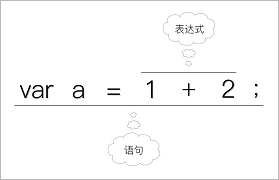
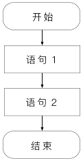
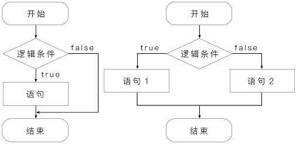
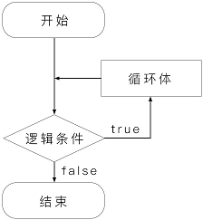
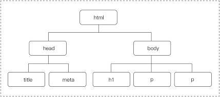
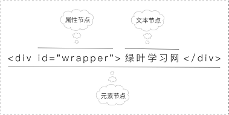

# 目录

# 简介

## 简介

> JavaScript，就是我们通常所说的JS。这是一种嵌入到HTML页面中的编程语言，由浏览器一边解释一边执行。

Java 和 JavaScript 名字很相似，但是本质上是不同的。JavaScript最初的确是受Java启发而开始设计的，而且设计的目的之一就是“看上去像Java”，因此语法上有不少类似之处，JavaScript很多名称和命名规则也借自Java。但是实际上，JavaScript主要设计原则源自Self和Scheme。

## 引入方式

### 一、外部引用

```js
<script src="xxx.js"></script>
```

对于CSS来说，外部 CSS 文件只能在head中引入。不过对于JavaScript 来说，外部 JavaScript 文件不仅可以在 head 中引入，还可以在 body 中引入.

此外还需要注意一点，引入外部CSS文件使用的是“link标签”，而引入外部JavaScript文件使用的是“script标签”。

### 二、内部引用

```js
<script> 或 <script type="text/javascript">
   ...    
</script>
```

内部JavaScript文件不仅可以在head中引入，也可以在body中引入。一般情况下，我们都是在head中引入。

### 三、元素内引用

```js
<input type="button" value="按钮" onclick="alert('绿叶学习，给你初恋般的感觉')"/>
```

# 语法基础

> 我已经掌握了 Java 和 C++ ，这章简单学习一下不同的地方，相似的地方快速略过。

## 变量和常量

### 一、变量

在JavaScript中，变量指的是一个可以改变的量。也就是说，变量的值在程序运行过程中是可以改变的。

#### 1．变量的命名

**（1）变量由字母、下划线、$或数字组成，并且第一个字母必须是“字母、下划线或$”。**

**（2）变量不能是系统关键字和保留字。**

#### 2．变量的使用

```js
var a=10,b=20,c=30;
```

### 二、常量

常量指的是一个不能改变的量。也就是说，常量的值从定义开始就是固定的，一直到程序结束都不会改变。

## 数据类型

> 在JavaScript中，数据类型可以分为两种：一种是“**基本数据类型**”；另外一种是“**引用数据类型**”。其中，基本数据类型只有一个值，而引用数据类型可以含有多个值。
>
> 在JavaScript中，基本数据类型有5种：**数字、字符串、布尔值、未定义值和空值**。而常见的引用数据类型有两种：**数组、对象**。这一节我们先来介绍一下基本数据类型，在后面章节再逐渐介绍“数组”和“对象”这两种引用数据类型。

在 JavaScript 中，变量的定义不需要区分数据类型，统一用 **var** 定义。

```js
var n; //此时 n 的值为 undefined
var n = null; //表示系统没有给这个变量n分配内存空间
```

## 运算符

### 一、算术运算符

算数运算符有 **+ - * / % ++ --** 。对于算术运算符，我们需要重点掌握这3种：加法运算符、自增运算符、自减运算符。

#### 1．加法运算符

当一个字符串加上另外一个字符串时，得到的是两个字符串的连接。

#### 2．自增运算符

i++指的是在**使用i之后**，再让i的值加上1；++i”指的是在**使用i之前**，先让i的值加上1。

#### 3．自减运算符

“- -”与“++”使用方法是一样的。

### 二、赋值运算符

在JavaScript中，赋值运算符用于将右边表达式的值保存到左边的变量中去，如下表所示。

| 运算符 | 举例                    |
| :----- | :---------------------- |
| =      | var str=“绿叶学习网”    |
| +=     | var a+=b等价于var a=a+b |
| -=     | var a-=b等价于var a=a-b |
| *=     | var a*=b等价于var a=a*b |
| /=     | var a/=b等价于var a=a/b |

### 三、比较运算符

在JavaScript中，比较运算符用于将运算符两边的值或表达式进行比较，如果比较结果是对的，则返回true；如果比较结果是错的，则返回false。true和false是布尔值，前面我们已经介绍了。比较运算符如下表所示。

| 运算符 | 说明     | 举例              |
| :----- | :------- | :---------------- |
| >      | 大于     | 2>1  //返回true   |
| <      | 小于     | 2<1   //返回false |
| >=     | 大于等于 | 2>=2  //返回true  |
| <=     | 小于等于 | 2<=2  //返回true  |
| ==     | 等于     | 1==2  //返回false |
| !=     | 不等于   | 1!=2   //返回true |

### 四、逻辑运算符

在JavaScript中，逻辑运算符用于执行“布尔值的运算”，它常常和比较运算符结合在一起使用。常见逻辑运算符有3种，如下表所示。

| 运算符 | 说明     |
| :----- | :------- |
| &&     | “与”运算 |
| \|\|   | “或”运算 |
| !      | “非”运算 |

### 五、条件运算符

除了上面这些常用的运算符，JavaScript还为我们提供了一种特殊的运算符：条件运算符。条件运算符，也叫“三目运算符”。在JavaScript中，条件运算符用英文问号（?）表示。

语法：

```js
var a = 条件 ? 表达式1 : 表达式2;
```

## 表达式与语句



一个表达式加上一个分号就组成一个语句。

## 类型转换

在JavaScript中，共有2种类型转换。

**（1）隐式类型转换**

隐式类型转换，指的是JavaScript自动进行的类型转换。显式类型转换，指的是需要我们手动用代码强制进行的类型转换。对于隐式类型转换，这里就不作介绍了。

**（2）显式类型转换**

我们重点介绍一下显式类型转换的两种情况。

### 一、字符串转数字

在JavaScript中，想要将字符串转换为数字，可以有2种方式。

**（1）Number()**

```js
// Number() 只能将纯包含数字的字符串转换成数字，当字符串中含有字母就会失败。
document.write(Number("1000") + 1000);
 -- 2000
document.write(Number("100px"));
 -- NaN // NaN指的是“Not a Number（非数字）”
```

**（2）parseInt()和parseFloat()**

```js
document.write(parseInt("100px"));
 -- 100
document.write(parseInt("hao123"));
 -- NaN 
	//parseInt()会从左到右进行判断，如果第1个字符是数字，则继续判断，直到出现非数字为止（小数点也是非数字）；如果第1个字符是非数字，则直接返回NaN。

document.write(parseInt("-1000");
 -- -1000 //加减号是可以转换的
document.write(parseInt("3.14"));
 -- 3
document.write(parseFloat("3.14"));
 -- 3.14
//parseFloat()跟parseInt()的区别就是parseInt()可以将小数部分转化。

```

### 二、数字转字符串

在JavaScript中，想要将数字转换为字符串，也有2种方式。

**（1）与空字符串相加**

```js
document.write(123 + "");
```

**（2）toString()**

```js
var a = 2018;
var b = a.toString() + 1000;
```

在实际开发中，如果想要将数字转换为字符串来用，我们很少使用toString()方法，而更多使用隐式类型转换的方式（也就是直接跟一个字符串相加）就行了。

## 转义字符

所谓的转义字符，指的是在默认情况下某些字符在浏览器是无法显示的，不过为了能够让这些字符能够显示出来，我们可以使用这些字符对应的转义字符来代替。在JavaScript中，常见的转义字符如表所示。

| 转义字符 | 说明       |
| :------- | :--------- |
| `\'`     | 英文单引号 |
| `\"`     | 英文双引号 |
| \n       | 换行符     |

实际上，JavaScript中的转义字符很多，但是我们只需要记住上面3种就可以了。此外还需要特别说明一下，对于字符串的换行，有以下2种情况。

**（1）如果是在document.write()中换行，则应该用：`<br/>`**

**（2）如果是在alert()中换行，则应该用：\n**

## 注释

```js
// 单行注释
/*
	多
	行
	注
	释
*/
```

# 流程控制

## 简介

> 流程控制，是任何一门编程语言都有的一个语法，指的是控制程序按照怎样的顺序执行的。
>
> 在JavaScript中，共有3种流程控制方式（其实任何语言也只有这3种）。


### 一、顺序结构

在JavaScript中，顺序结构是最基本的结构。所谓的顺序结构，说白了，就是代码按照从上到下、从左到右的“顺序”执行。



### 二、选择结构

在JavaScript中，选择结构指的是根据“条件判断”来决定使用哪一段代码。选择结构有3种：单向选择、双向选择以及多向选择，但是无论是哪一种，JavaScript都只会执行其中的一个分支。



### 三、循环结构

循环结构，指的是根据条件来判断是否重复执行某一段程序。若条件为true，则继续循环；若条件为false，则退出循环。



## 结构

选择结构：if, swith

循环结构：while, do while, for

## 实战

### 一、判断一个数是小数还是整数？

```js
var n = 3.14
if(parseInt(n.toString())==parseFloat(n.toString())){
	document.write(n+ "是整数")
}else{
	document.write(n + "是小数")
}
```

### 二、找出“水仙花数”

```js
var str = "";
for(var n=100;n<1000;n++){
    var a = n%10;
    var b = (n/10)%10;
    b = parseInt(b);
    // 没有这句话会导致无法显示结果，因为 JavaScript 中没有定义类型，所以得到的结果是包含小数的，平时在Java里面定义 int a ，所以不需要舍弃小数。 
    var c = n/100;
    c = parseInt(c);
    if(n == (a*a*a + b*b*b + c*c*c)){
        str = str + n + "，";
    }
}
```

# 函数

> 函数一般是在两种种情况下使用：一种是“重复使用的功能”，另外一种是“特定的功能”。

## 函数的定义

在JavaScript中，函数可以分两种：一种是“没有返回值的函数”；另外一种就是“有返回值的函数”。无论是哪一种函数，都必须使用function来定义的。

### 一、定义函数

```js
//无返回值
function 函数名(参数1 , 参数2 ,..., 参数n){
    ...
}
//有返回值    
function 函数名(参数1 , 参数2 ,..., 参数n){
    ...
    return 返回值;
}
```

### 二、全局变量与局部变量

在JavaScript中，变量有一定的作用域（也就是变量的有效范围）。根据作用域，变量可以分为以下2种。

**（1）全局变量**

全局变量一般在主程序中定义，其有效范围是从定义开始，一直到整个程序结束为止。说白了，全局变量在任何地方都可以用。

**（2）局部变量**

局部变量一般在函数中定义，其有效范围只限于在函数之中，函数执行完了就没了。说白了，局部变量只能在函数中使用，函数之外是不能使用函数之内定义的变量的。

## 函数的调用

### 一、直接调用

直接调用，是常见的函数调用方式，一般用于“没有返回值的函数”。

```js
函数名(实参1, 实参2, ... , 实参n);
```

### 二、在表达式中调用

在表达式中调用，一般用于“有返回值的函数”，然后函数的返回值会参与表达式的计算。

```js
var n = addSum(1, 2) + 100;
document.write(n);
```

### 三、在超链接中调用

在超链接中调用，指的是在a元素的href属性中使用“javascript:函数名”的形式来调用函数。当用户点击超链接时，就会调用该函数。

```
<a href="javascript:函数名"></a>
```

### 四、在事件中调用

JavaScript是基于事件的一门语言，像鼠标移动是一个事件、鼠标单击也是一个事件，类似的事件很多。当一个事件产生的时候，我们就可以调用某个函数来针对这个事件作出响应。

```js
<input type="button" onclick="alertMes()" value="提交" />
```

## 嵌套函数

嵌套函数，简单来说，就是在一个函数的内部定义另外一个函数。不过在内部定义的函数只能在内部调用，如果在外部调用，就会出错。

## 内置函数

在JavaScript中，函数还可以分为“自定义函数”和“内置函数”。自定义函数，指的是需要我们自己定义的函数，前面学的就是自定义函数。内置函数，指的是JavaScript内部已经定义好的函数，也就是说我们不需要自己写函数体，直接调用就行了，如下表所示。

| 函数         | 说明                                 |
| :----------- | :----------------------------------- |
| parseInt()   | 提取字符串中的数字，只限提取整数     |
| parseFloat() | 提取字符串中的数字，可以提取小数     |
| isFinite()   | 判断某一个数是否是一个有限数值       |
| isNaN()      | 判断一个数是否是NaN值                |
| escape()     | 对字符串进行编码                     |
| unescape()   | 对字符串进行解码                     |
| eval()       | 把一个字符串当做一个表达式一样去执行 |

# 对象

> 在JavaScript中，对象是非常重要的知识点。对象可以分为两种：一种是“自定义对象”；另外一种是“内置对象”。自定义对象，指的是需要我们自己定义的对象，跟“自定义函数”是一样的道理；内置对象，指的是不需要我们自己定义（即系统已经定义好的）、可以直接使用的对象，跟“内置函数”也是一样的道理。

## 字符串对象

### 一、获取字符串长度

```js
字符串名.length;
```

### 二、大小写转换

```js
字符串名.toLowerCase()
字符串名.toUpperCase()
```

### 三、获取某一个字符

```js
字符串名.charAt(n)
// 注意 n 从0开始
```

### 四、截取字符串

```js
字符串名.substring(start, end)
```

substring(start,end)截取范围为：[start,end)，也就是包含 start，不包含 end。其中，end 可以省略。当 end 省略时，截取的范围为：**start 到结尾**。

### 五、替换字符串

```js
字符串名.replace(原字符串, 替换字符串)
字符串名.replace(正则表达式, 替换字符串)
```

### 六、分割字符串

```js
字符串名.split("分割符")

字符串名.split("") //这样也是可行的
```

分割得到的结果是一个数组。

### 七、检索字符串的位置

```js
字符串名.indexOf(指定字符串)
字符串名.lastIndexOf(指定字符串)
```

在JavaScript中，可以使用indexOf()方法来找出“某个指定字符串”在字符串中**首次出现**的下标位置，也可以使用lastIndexOf()来找出“某个指定字符串”在字符串中**最后出现**的下标位置。

如果字符串中不包含“指定字符串”，则返回-1。

## 数组对象

### 一、数组的创建

```js
var 数组名 = new Array(元素1, 元素2, ……, 元素n);    //完整形式
var 数组名 = [元素1, 元素2, ……, 元素n];             //简写形式
```

**数组的下标是从0开始的，而不是从1开始的**。如果获取第1项应该用arr[0]。

### 二、截取数组部分

在JavaScript中，我们可以使用slice()方法来获取数组的某一部分。slice，就是“切片”的意思。

```js
数组名.slice(start, end);
```

slice()方法跟上一章学的substring()非常像，用法基本一样。

### 三、添加数组元素

#### 1．在数组开头添加元素

```js
数组名.unshift(新元素1, 新元素2, ……, 新元素n)
```

#### 2．在数组结尾添加元素

```js
数组名.push(新元素1, 新元素2, ……, 新元素n)
```

### 四、删除数组元素

#### 1．删除数组中第一个元素

```js
数组名.shift()
```

#### 2．删除数组最后一个元素

```js
数组名.pop()
```

### 四、数组排序

在JavaScript中，我们可以使用sort()方法来对数组中所有元素进行大小比较，然后按从大到小或者从小到大进行排序。

```
数组名.sort(函数名)
```

```js
//定义一个升序函数
function up(a, b) {
    return a - b;
}
//定义一个降序函数
function down(a, b) {
    return b - a;
}

var arr = [3, 9, 1, 12, 50, 21];
arr.sort(up);
document.write("升序：" + arr.join("、") + "<br/>");
arr.sort(down);
document.write("降序：" + arr.join("、"));
```

### 五、数组颠倒顺序

在JavaScript中，我们可以使用reverse()方法来实现数组中所有元素的反向排列，也就是颠倒数组元素的顺序。reverse，就是“反向”的意思。

```js
数组名.reverse();
```

### 六、将数组元素连接成字符串

在JavaScript中，我们可以使用join()方法来将数组中的所有元素连接成一个字符串。

```js
数组名.join("连接符");
```

## 时间对

在JavaScript中，我们可以使用时间对象Date来处理时间。

```js
var 日期对象名 = new Date();
```

创建一个日期对象，必须使用new关键字。其中Date对象的方法有很多，主要分为两大类：getXxx()和setXxx()。getXxx()用于获取时间，setXxx()用于设置时间。

**用于获取时间的getXxx()**

| 方法          | 说明                                                      |
| :------------ | :-------------------------------------------------------- |
| getFullYear() | 获取年份，取值为4位数字                                   |
| getMonth()    | 获取月份，取值为0（一月）到11（十二月）之间的整数         |
| getDate()     | 获取日数，取值为1~31之间的整数                            |
| getHours()    | 获取小时数，取值为0~23之间的整数                          |
| getMinutes()  | 获取分钟数，取值为0~59之间的整数                          |
| getSeconds()  | 获取秒数，取值为0~59之间的整数                            |
| getDay()      | 返回一个数字，其中0表示星期天，1表示星期一……6表示星期六。 |

**用于设置时间的setXxx()**

| 方法          | 说明                     |
| :------------ | :----------------------- |
| setFullYear() | 可以设置年、月、日       |
| setMonth()    | 可以设置月、日           |
| setDate()     | 可以设置日               |
| setHours()    | 可以设置时、分、秒、毫秒 |
| setMinutes()  | 可以设置分、秒、毫秒     |
| setSeconds()  | 可以设置秒、毫秒         |

## 数学对象

### 一、简介

在JavaScript中，我们可以使用Math对象的属性和方法来实现各种运算。Math对象为我们提供了大量“内置”的数学常量和数学函数，极大地满足了实际开发需求。

Math对象跟其他对象不一样，我们不需要使用new关键字来创造，而是直接使用它的属性和方法就行。

```js
Math.xxx
```

### 二、Math对象属性

| 属性    | 说明              | 对应的数学形式 |
| :------ | :---------------- | :------------- |
| PI      | 圆周率            | π              |
| LN2     | 2的自然对数       | ln(2)          |
| LN10    | 10的自然对数      | ln(10)         |
| LOG2E   | 以2为底的e的对数  | log2e          |
| LOG10E  | 以10为底的e的对数 | log10e         |
| SQRT2   | 2的平方根         | √2             |
| SQRT1_2 | 2的平方根的倒数   | 1/√2           |

在实际开发中，所有角度都是以“弧度”为单位的，例如180°就应该写成Math.PI，而360°就应该写成Math.PI*2，以此类推。对于角度，在实际开发中推荐这种写法：“**度数 \* Math.PI/180**”，因为这种写法可以让我们一眼就能看出角度是多少，例如：

```js
120*Math.PI/180   //120°
150*Math.PI/180   //150°
```

上面这个技巧非常重要，在以后的各种开发（如JavaScript动画、HTML5 Canvas动画等）中用得也非常多，大家要认真掌握。

### 三、Math对象方法

 **Math对象中的方法（常用）**

| 方法         | 说明                   |
| :----------- | :--------------------- |
| max(a,b,…,n) | 返回一组数中的最大值   |
| min(a,b,…,n) | 返回一组数中的最小值   |
| sin(x)       | 正弦                   |
| cos(x)       | 余弦                   |
| tan(x)       | 正切                   |
| asin(x)      | 反正弦                 |
| acos(x)      | 反余弦                 |
| atan(x)      | 反正切                 |
| atan2(y, x)  | 反正切（注意y、x顺序） |
| floor(x)     | 向下取整               |
| ceil(x)      | 向上取整               |
| random()     | 生成随机数             |

**Math对象中的方法（不常用）**

| 方法     | 说明                     |
| :------- | :----------------------- |
| abs(x)   | 返回x的绝对值            |
| sqrt(x)  | 返回x的平方根            |
| log(x)   | 返回x的自然对数（底为e） |
| pow(x,y) | 返回x的y次幂             |
| exp(x)   | 返回e的指数              |

#### 四、实战题：生成随机验证码

```js
var str = "abcdefghijklmnopqrstuvwxyzABCDEFGHIJKLMNOPQRSTUVWXYZ1234567890";
var arr = str.split("");
var result = "";
for(var i=0;i<4;i++){
    var n = Math.floor(Math.random() * arr.length);
    result += arr[n];
}
document.write(result);
```

# DOM

## 前言

> 前面的内容是JavaScript的基础部分，介绍的都是基本语法知识。
>
> 接下来是 JavaScript 的核心技术，这些才是我们要重点掌握的东西，同时也是更高级技术（如jQuery、HTML5等）的基础。学完这部分，我们不仅可以制作各种炫丽的特效，还可以结合HTML和CSS，来开发一个真正意义上的页面了。

## 简介

## 一、DOM对象

DOM，全称“Document Object Model（文档对象模型）”，它是由W3C定义的一个标准。

在实际开发中，我们有时候需要实现鼠标移到某个元素上面时就改变颜色，或者动态添加元素或者删除元素等。其实这些效果就是通过DOM提供的方法来实现的。

简单来说，DOM里面有很多方法，我们通过它提供的方法来操作一个页面中的某个元素，例如改变这个元素的颜色、点击这个元素实现某些效果、直接把这个元素删除等。

一句话总结就是：**DOM操作，可以简单理解成“元素操作”。**

## 二、DOM结构

DOM采用的是“树形结构”，用“树节点”形式来表示页面中的每一个元素。一个有 h1、p、p 的 html 结构文档，DOM会将其解析为如下图所示的树形结构：




是不是很像一棵树呢？其实，这也叫做“DOM树”。在这棵树上，html元素是树根，也叫根元素。

接下来深入一层，我们发现有head和body这两个分支，它们位于同一层次上，并且有着共同的父节点（即html），所以它们是兄弟节点。

head有两个子节点：title、meta（这两个是兄弟节点）。body 有3个子节点：h1、p、p。当然，如果还有下一层，我们还可以继续找下去。

利用这种简单的 **家谱关系** 我们可以把各节点之间的关系清晰地表达出来。那么为什么要把一个HTML页面用树形结构表示呢？这也是为了更好地给每一个元素进行定位，以便让我们找到想要的元素。

每一个元素就是一个节点，而每一个节点就是一个对象。也就是说，**我们在操作元素时，其实就是把这个元素看成一个对象，然后使用这个对象的属性和方法来进行相关操作**（这句话对理解DOM操作太重要了）。

## 节点类型

在JavaScript中，节点也是分为很多类型的。DOM节点共有12种类型，不过常见的只有3种（其他的不用管）。

**（1）元素节点**

**（2）属性节点**

**（3）文本节点**

****实际上，这里有3个节点。**节点跟元素是不一样的概念，节点是包括元素的。**

```
<div id="wrapper">绿叶学习网</div>
```



## 获取元素

获取元素，准确来说，就是获取“元素节点（注意不是属性节点或文本节点）”。对于一个页面，我们想要对某个元素进行操作，就必须通过一定的方式来获取该元素，只有获取到了，才能对其进行相应的操作。

咦，这不跟CSS选择器相似吗？说得没错。只不过选择器是CSS的操作方式，而JavaScript却有着属于自己的另一套方法。在JavaScript中，我们可以通过以下6种方式来获取指定元素。

### 一、getElementById()

实际上，getElementById() 类似于CSS中的id选择器，只不过 getElementById() 是 JavaScript 的操作方式，而 id 选择器是 CSS 的操作方式。

```js
document.getElementById("id名")
```

### 二、getElementsByTagName()

在JavaScript中，如果想通过标签名来选中元素，我们可以使用 getElementsByTagName() 方法来实现。同样，getElementsByTagName()类似于CSS中的“元素选择器”。

```js
document. getElementsByTagName("标签名")
//getElementsByTagName()获取的是多个元素，操作的时候要用数组的方法。
```

准确来说，getElementsByTagName()方法获取的是一个“类数组”（也叫伪数组）**类数组只能用到两点：length属性；下标形式**。

### 三、getElementsByClassName()

在JavaScript中，如果想通过class来选中元素，我们可以使用getElementsByClassName()方法来实现.同样，getElementsByClassName()类似于CSS中的class选择器。

```js
document. getElementsByClassName("类名")
```

说明：

跟getElementsByTagName相似，getElementsByClassName()获取的也是一个类数组。

### 四、querySelector()和querySelectorAll()

我们可以使用CSS选择器的语法来获取所需要的元素。

```js
document.querySelector("选择器");
document.querySelectorAll("选择器");
```

querySelector()表示选取满足选择条件的第1个元素，querySelectorAll()表示选取满足条件的所有元素。这两个方法都是非常简单的，它们的写法跟CSS选择器的写法是完全一样的。

```js
document.querySelector("#main")
document.querySelector("#list li:nth-child(1)")
document.querySelectorAll("#list li")
document.querySelectorAll("input:checkbox")
```

### 五、getElementsByName()

对于表单元素来说，它有一个一般元素都没有的name属性。如果想要通过name属性来获取表单元素，我们可以使用getElementsByName()方法来实现。

```js
document.getElementsByName("name名")
```

getElementsByName()只用于表单元素，一般只用于单选按钮和复选框。

### 六、document.title和document.body

由于一个页面只有一个title元素和一个body元素，因此对于这两个元素的选取，JavaScript专门为我们提供了两个非常方便的方法：document.title和document.body。

## 创建元素

这种方式又被称为“动态DOM操作”。所谓的“动态DOM”，指的是使用JavaScript创建的元素，这个元素一开始在HTML中是不存在的。

```js
var e1 = document.createElement("元素名");      //创建元素节点
var txt = document.createTextNode("文本内容");   //创建文本节点
e1.appendChild(txt);                          //把文本节点插入元素节点中
e2.appendChild(e1);                    
```

例如：

```js
var oDiv = document.getElementById("content");
var oStrong = document.createElement("strong");
var oTxt = document.createTextNode("绿叶学习网");
//将文本节点插入strong元素
oStrong.appendChild(oTxt);
//将strong元素插入div元素（这个div在HTML已经存在）
oDiv.appendChild(oStrong);
	...
<div id="content"></div>
```

如果想要创建一个元素，需要以下4步。

① 创建元素节点：createElement()

② 创建文本节点：createTextNode()

③ 把文本节点插入元素节点：appendChild()

④ 把组装好的元素插入到已有元素中：appendChild()

## 插入元素

在JavaScript中，我们可以使用 **appendChild()** 把一个新元素插入到父元素的内部子元素的 **末尾** 。

在JavaScript中，我们可以使用 insertBefore() 方法将一个新元素插入到父元素中的某一个子元素**之前**。

## 删除元素

在JavaScript中，我们可以使用 **removeChild()** 方法来删除父元素下的某个子元素。

## 复制元素

在JavaScript中，我们可以使用 **cloneNode()** 方法来实现复制元素。

```js
obj.cloneNode(bool)
/*  参数obj表示被复制的元素，而参数bool是一个布尔值.
	可选。默认是 false。
	设置为 true，如果您需要克隆节点及其属性，以及后代
	设置为 false，如果您只需要克隆节点及其后代 
*/
```

## 替换元素

```js
A.replaceChild(new,old);
```

A表示父元素，new表示新子元素，old表示旧子元素。

# 事件

## 简介

在之前的学习中，我们接触过鼠标点击事件（即onclick）。那事件究竟是什么呢？举个例子，当我们点击一个按钮时，会弹出一个对话框。其中“点击”就是一个事件，“弹出对话框”就是我们在点击这个事件里面做的一些事情。

## 事件调用方式

### 一、在script标签中调用

在script标签中调用事件，指的是在< script >< /script >标签内部调用事件。

```js
obj.事件名 = function()
{
    ……
};
//obj是一个DOM对象，所谓的DOM对象，指的是使用getElementById()、getElementsByTagName()等方法获取到的元素节点。
```

### 二、在元素中调用事件

在元素中调用事件，指的是直接在HTML属性中来调用事件，这个属性又叫做“事件属性”。

```js
<script>
    function alertMes(){
    alert("绿叶学习网");
}
</script>
	...
<input type="button" onclick="alertMes()" value="弹出" />
```

## 鼠标事件

| 事件        | 说明         |
| :---------- | :----------- |
| onclick     | 鼠标单击事件 |
| onmouseover | 鼠标移入事件 |
| onmouseout  | 鼠标移出事件 |
| onmousedown | 鼠标按下事件 |
| onmouseup   | 鼠标松开事件 |
| onmousemove | 鼠标移动事件 |

## 键盘事件

在JavaScript中，常用的键盘事件共有2种。

**（1）键盘按下：onkeydown**

**（2）键盘松开：onkeyup**

## 表单事件

在JavaScript中，常用的表单事件有3种。

### 一、onfocus和onblur

onfocus表示获取焦点时触发的事件，而onblur表示失去焦点时触发的事件，两者是相反操作。

onfocus和onblur这两个事件往往都是配合一起使用的。例如用户准备在文本框中输入内容时，此时它会获得光标，就会触发onfocus事件。当文本框失去光标时，就会触发onblur事件。

判断一个元素是否具有焦点很简单，**我们打开一个页面后按Tab键，能够选中的就是具有焦点特性的元素**。在实际开发中，焦点事件（onfocus和onblur）一般用于单行文本框和多行文本框这两个，其他地方比较少用。

### 二、onselect

在JavaScript中，当我们选中“单行文本框”或“多行文本框”中的内容时，就会触发onselect事件。

当我们选中单行文本框或多行文本框中的内容时，都会弹出对应的对话框。onselect事件在实际开发中用得极少，我们了解一下就行，不需要深入。

### 三、onchange

在JavaScript中，onchange事件常用于“具有多个选项的表单元素”。

**（1）单选框选择某一项时触发。**

**（2）复选框选择某一项时触发。**

**（3）下拉列表选择某一项时触发。**

## 编辑事件

### 一、oncopy

在JavaScript中，我们可以使用oncopy事件来防止页面内容被复制。

```js
document.body.oncopy = function () {
    return false;
}
```

### 二、onselectstart

在JavaScript中，我们可以使用onselectstart事件来防止页面内容被选取。

```js
document.body.onselectstart=function(){
    return false;
}
```

防止页面内容被选取，从本质上来说也是为了防止用户复制内容。也就是说，为了防止用户复制内容，我们有两种实现方式：oncopy事件和onselectstart事件。

## 三、oncontextmenu

在JavaScript中，我们可以使用oncontextmenu事件来禁止鼠标右键。

```js
document.oncontextmenu = function () {
    return false;
}
```

总的来说，oncopy、onselectstart、oncontextmenu这3个在大多数情况下都是用来保护版权的。不过为了更好的用户体验，我们还是少用为妙，除非是迫不得已的情况。

## 页面事件

### 一、onload

在JavaScript中，onload表示文档加载完成后再执行的一个事件。

### 二、onbeforeunload

在JavaScript中，onbeforeunload表示离开页面之前触发的一个事件。